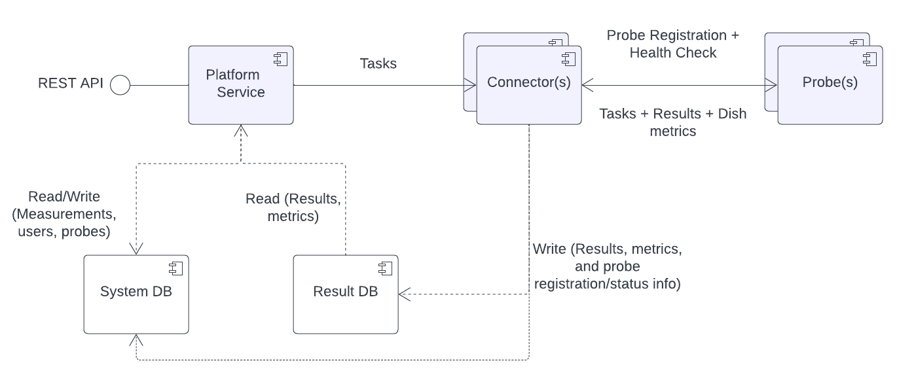

# An Extensible Global Network Measurement Platform

This platforms allows users to perform internet measurements or run arbitrary code (Custom scripts, iRTT, etc.) on software-probes (Docker-based) running on heterogeneous hardware such as virtual machines, Raspberry Pi's, etc. Users registered on this platform can self-host these software probes on their own hardware.

The software probes are Docker based containers that are expected to be kept running at all times. They use the [Sysbox](https://github.com/nestybox/sysbox) runtime to ensure container isolation and thereby safety for host hardware/OS.

The software probes also support Starlink based connections and provide the added functionality of gathering metadata from the Starlink dish/router. This metadata containing information such as Uplink/Downlink speeds, Dish obstruction data, etc. is bundled along with the measurement results.

## Project Structure

1. _platform-service_: This is the main Java-Spring based API service exposed to end users. It makes use of Maven, JDK 17 and MongoDB. Service specific documentation can be found in the README file within the folder. The latest container image is currently hosted at https://hub.docker.com/r/cmnetworkplatform/prod with the platform tag.

2. _connector-service_: This is the Java-Spring based service that connects the platform-service and probe-service. It handles results persistence, probe registration and communication. It makes use of Maven, JDK 17 and MongoDB. Service specific documentation can be found in the README file within the folder. The latest container image is currently hosted at https://hub.docker.com/r/cmnetworkplatform/prod with the connector tag.

3. _probe-service_: This is the Java-Spring based service that runs directly on the probes. It handles measurement execution and uploading of results. It makes use of Maven and JDK 17. Service specific documentation can be found in the README file within the folder. The latest container image is currently hosted at https://hub.docker.com/r/cmnetworkplatform/probe-outer.

4. _predefined-measurements-dockerfile_: This contains the dockerfile used for the internal container that runs all the predefined measurements. The latest container image is currently hosted at https://hub.docker.com/r/cmnetworkplatform/probe-inner.

## Architecture

The platform is decomposed into three components - the platform service, the connector service and the probe service.

The platform service is the brain:
1. It handles user, probe, and measurement management via a REST API
2. It forwards measurements to the connector service
3. It handles user, measurement and probe persistence to the system database
4. It provides measurement results

The connector service is an intermediary controller:
1. It is responsible for managing a set of region based probes
2. It handles probe registration and probe health checks/disconnects
3. It splits an incoming measurement into tasks and forwards these tasks to the specified probes at the time of task execution
4. It receives results from probes and persists to the results database

Probe services are deployed on user hardware:
1. They establish the connection to the connector service
2. They provide health check data regularly to the connector service
2. They collect dish metadata from Starlink routers
3. They run measurements and send result data back to the connector service